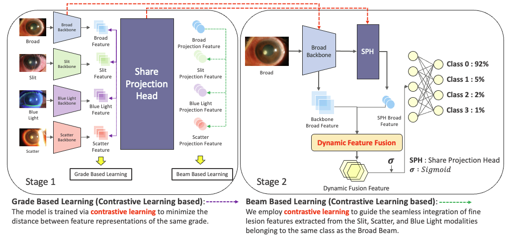
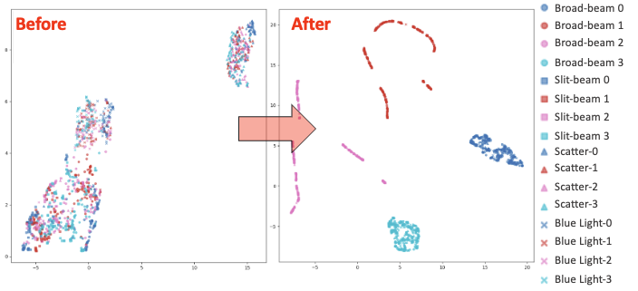

# Multimodal Fusion Framework Using Contrastive Learning for Exposure Keratopathy

**Gyutae Oh<sup>1,*</sup>**, **Yeokyoung Won<sup>2</sup>**, **Donghui Lim<sup>2,†</sup>**, **Jitae Shin<sup>1,†</sup>**

<sup>1</sup>Department of Electrical and Computer Engineering, Sungkyunkwan University  
<sup>2</sup>Department of Ophthalmology, Samsung Medical Center, Sungkyunkwan University School of Medicine

* First author  
† Corresponding author 


Contact: alswo740012@g.skku.edu, wyk900105@hanmail.net, ldhlse@gmail.com, jtshin@skku.edu

[Paper/Code GitHub](https://github.com/GYUGYUT/Multimodal-Fusion-Framework-Using-Contrastive-Learning-for-Exposure-Keratopathy)

<p align="center">
  <br>
  <i>Figure 1. This figure illustrates the overall architecture, showing the general workflow and example images for the broad-beam, slit-beam, blue-light, and scatter modalities. However, because the data used in this experiment are strictly prohibited from external distribution, we obtained prior permission from the first and corresponding authors to use similar images from [30] (CC BY 4.0) as alternatives.</i>
</p>

<p align="center">
  <br>
  <i>Figure 2. This figure uses UMAP[23] to visualize the features before and after training with our proposed method for each independently trained backbone, grouped by modality and grade. Detailed information for each modality and grade is shown on the right side of the figure. Identical colors represent the same grade, and identical shapes represent the same modality.</i>
</p>

<p align="center">
<b>A multimodal fusion framework for automated grading of exposure keratopathy using four types of anterior segment images (broad-beam, slit-beam, scatter, blue-light). Achieves high diagnostic performance with contrastive learning-based feature fusion, even with single-modality input at inference.</b>
</p>
<br>

# Overview

🔍 Overview

This project proposes a two-stage multimodal fusion framework for the automated grading of exposure keratopathy.

Although accurate diagnosis requires multiple illumination-based anterior segment images —
broad-beam, slit-beam, scatter, and blue-light — acquiring all modalities is often impractical in real-world clinical settings.

To overcome this challenge, our method performs multimodal contrastive learning during training, but requires only a single broad-beam image at inference.

🧠 Method

Stage 1: Contrastive Multimodal Representation Learning
	•	Applies Grade Based Learning (GBL) and Beam Based Learning (BBL)
	•	Encourages the broad-beam image to encode pathological cues from the other three modalities

Stage 2: Dynamic Feature Fusion (DFF)
	•	Fuses feature vectors from Stage 1 via a learnable scalar weight (α)
	•	Achieves high classification accuracy using only broad-beam input

📈 Results

Compared to single-modality baselines:
	•	+16% improvement in accuracy
	•	+13% improvement in F1 score

This framework enables efficient, high-performance diagnosis with minimal imaging requirements — making it well-suited for real-world deployment in medical environments.
# Installation
```bash
pip install -r requirements.txt
```

# Data Preparation
The study was approved by the Institutional Review Board (IRB) of the Samsung Medical Center (IRB no. 2024-12-004).
Accordingly, the dataset used in this study cannot be publicly released due to privacy regulations.
Only the training code is provided, and users are required to prepare their own datasets.
If a dataset is prepared, an .xlsx file containing data split information must be created, and the correct path should be specified in the run_train.sh script.
Depending on the dataset structure, modifications to the smc_dataloader may also be necessary.

- Example (see `run_train.sh`):
  - `BROAD_TRAIN="grade_photo1_train.xlsx"` (replace with your own train file)
  - `IMAGE_FOLDER="SMC_New_original"` (replace with your own image folder)

# Usage
```bash
bash run_train.sh
```
- You can modify data paths, backbone, and hyperparameters in `run_train.sh`.
- Training and evaluation results will be saved in the `result/` folder.

# Main Results

## Table 2. Comparison of Individual and Combined Training Results
| Train Method | Train Data | Accuracy | Specificity | Sensitivity | F1 Score |
|--------------|------------|----------|-------------|-------------|----------|
| Supervised   | Broad-beam | 0.7045   | 0.9008      | 0.7015      | 0.7049   |
| Supervised   | Slit-beam  | 0.6692   | 0.8787      | 0.6686      | 0.6510   |
| Supervised   | Blue-light | 0.6447   | 0.8758      | 0.6407      | 0.6368   |
| Supervised   | Scatter    | 0.6957   | 0.8900      | 0.6685      | 0.6729   |
| Supervised   | Total      | 0.6865   | 0.8880      | 0.6783      | 0.6789   |
| **Ours**     | Stage 1:Total / Stage2:Broad | **0.8409** | **0.9462** | **0.8382** | **0.8379** |

## Table 3. Ablation Study: Performance Evaluation by Removing GBL, BBL, DFF
| GBL | BBL | DFF | Accuracy | Specificity | Sensitivity | F1 Score |
|-----|-----|-----|----------|-------------|-------------|----------|
| ✓   | ✓   |     | 0.7500   | 0.9154      | 0.7492      | 0.7563   |
| ✓   |     | ✓   | 0.7727   | 0.9235      | 0.7700      | 0.7710   |
|     | ✓   | ✓   | 0.7727   | 0.9232      | 0.7678      | 0.7685   |
| ✓   | ✓   | ✓   | 0.7954   | 0.9315      | 0.7969      | 0.7958   |
|     |     | ✓   | 0.6590   | 0.8858      | 0.6640      | 0.6634   |
| ✓   | ✓   | ✓   | **0.8409** | **0.9462** | **0.8382** | **0.8167** |

# Citation
```bibtex
@article{Oh2024MultimodalFusion,
  title={Multimodal Fusion Framework Using Contrastive Learning for Exposure Keratopathy},
  author={Gyutae Oh and Yeokyoung Won and Donghui Lim and Jitae Shin},
  journal={MICCAI OMIA Workshop},
  year={2024}
}
```

# Contact
- alswo740012@g.skku.edu (Gyutae Oh)
- wyk900105@hanmail.net (Yeokyoung Won)
- ldhlse@gmail.com (Donghui Lim)
- jtshin@skku.edu (Jitae Shin)